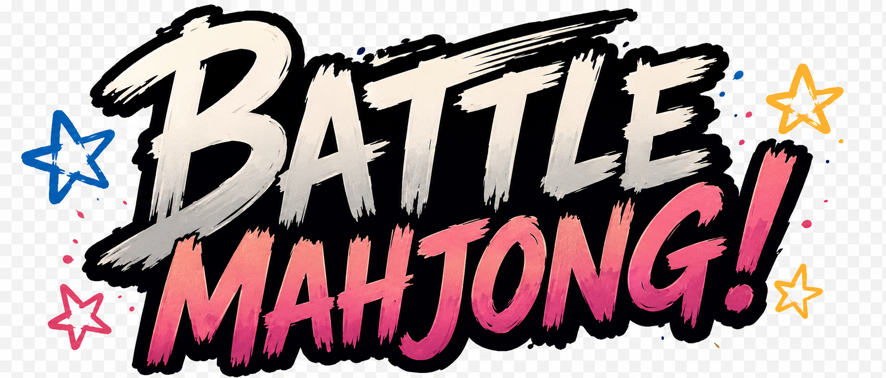

# Battle Mahjong

  

Battle Mahjong is a fast-paced mahjong solitaire game about solving continuously and solving quickly.

Core principle:

> Battle Mahjong is a game about staying in motion.

The project currently has deterministic gameplay implemented through M6 Consumables. Networking, monetization, accounts, backend systems, persistent collection, and later milestones remain out of scope until requested.

## Source Of Truth

Read these documents before implementing:

- [docs/GAME_VISION.md](docs/GAME_VISION.md)
- [docs/CORE_GAMEPLAY.md](docs/CORE_GAMEPLAY.md)
- [docs/SYSTEMS.md](docs/SYSTEMS.md)
- [docs/ROADMAP.md](docs/ROADMAP.md)
- [docs/ART_DIRECTION.md](docs/ART_DIRECTION.md)
- [docs/PLAYER_PROFILE.md](docs/PLAYER_PROFILE.md)
- [docs/TECH_NOTES.md](docs/TECH_NOTES.md)

## Current Status

- Engine choice: Godot 4.6.3 stable.
- Primary language: GDScript.
- Completed gameplay scope: M0 through M6.
- Current milestone: M7 Art Foundation, Batch A contract proof.
- Simulation and presentation remain separate.
- Gameplay randomness uses seeded deterministic RNG.

## Current Visual Slice

M7 Batch A currently proves responsive portrait-first board geometry, layered face artwork, independent modifier overlays, and visible-tile targeting for Delete Pair. Placeholder text remains while the complete Default face set is produced.

| Phone Portrait | Landscape |
| --- | --- |
|  |  |
