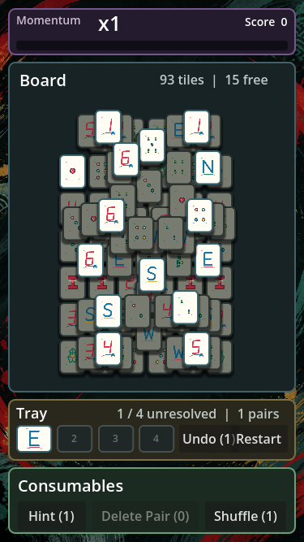
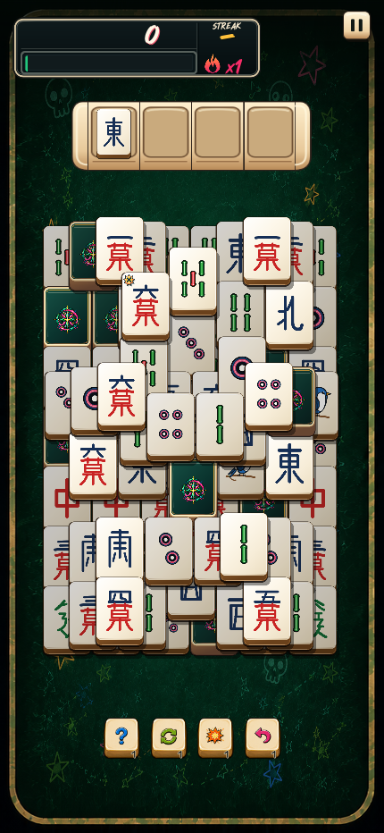
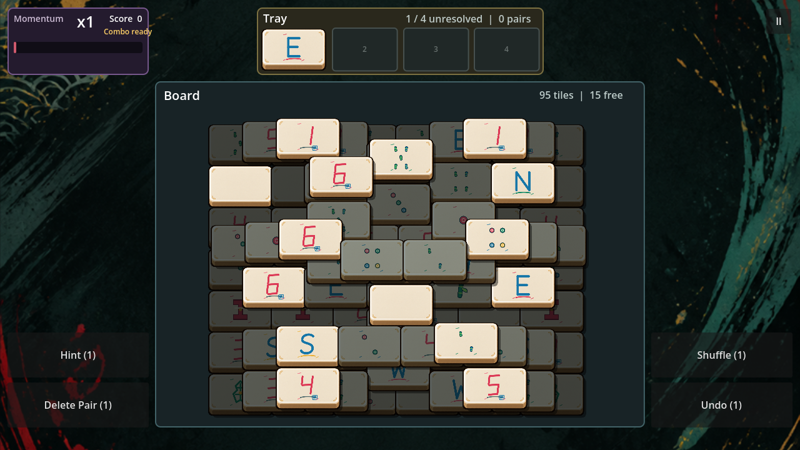
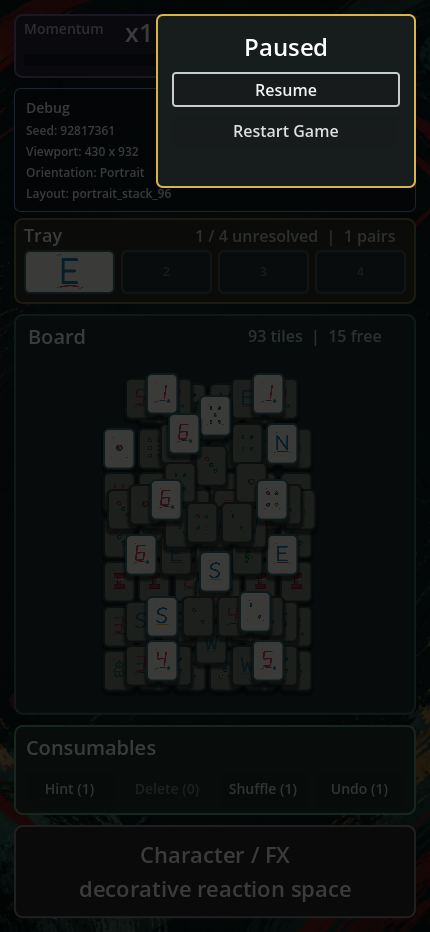

# M07 - Art Foundation And First Visual Slice

Status: In Progress - Batch A visual-slice candidate implemented

Goal: establish the visual asset system and produce the minimum artwork required to transform the functional prototype into the first recognizable version of Battle Mahjong.

The first title treatment is tracked at `game-assets/art/title_logo.png`. It establishes the energetic brush-lettered brand direction for project descriptions and review material; responsive in-game title placement remains later M7 presentation work.

The first portrait HUD implementation is tracked in [Figma Portrait Gameplay UI](../FIGMA_PORTRAIT_UI.md). It uses exported Figma artwork for the background, score, Momentum, pause, and composable queue while preserving runtime text, fill animation, live tray tiles, safe-area layout, and the existing gameplay state boundary.

## Current Review Captures

These generated smoke-test captures show the current Batch A candidate rather than final visual polish. The portrait-authored board geometry remains unchanged across orientations, blocked tiles use a reusable darkened state, every visible face is supplied by the shared skin manifest, and the aspect-covered background keeps its visual energy outside the board.

| Compact Phone | Phone Portrait | Landscape |
| --- | --- | --- |
|  |  |  |

The first modal session menu is also represented in the current slice:



This is the first major art-production milestone. It is not final visual polish.

## Roadmap Alignment

This milestone consolidates the earlier roadmap placeholders for `M7 Juice / Anime Arcade Feedback` and the foundational portion of `M8 Tile Skin + Art System`.

M7 now owns the first complete visual slice, including the canonical tile contract, initial Default and Neon skins, foundational FX, and representative character/background work. M8 remains available for expanded cosmetic production and later visual breadth after the foundation is proven.

## Purpose

M7 must:

- establish the canonical visual language;
- define reusable asset contracts;
- preserve excellent tile readability during fast play;
- prove tile skins can radically change appearance without changing gameplay;
- establish the anime and Y2K Japanese arcade personality;
- give engineering production-style assets for animation, effects, layout, import, atlas, and performance testing.

## Core Art Direction

The fundamental visual principle is:

> The board is disciplined; the feedback is exuberant.

The mahjong board must remain extremely clean and readable because rapid visual recognition is a core gameplay skill. Surrounding presentation may become increasingly wild as player performance improves.

Influences include:

- late-1990s and early-2000s Japanese arcade games;
- 2000s anime;
- Ridge Racer-style enthusiastic presentation and announcer energy;
- anime speed lines and impact frames;
- cute, slightly weird indie-game personality;
- bright arcade typography;
- character cut-ins;
- layered particles and exaggerated transitions.

At low momentum, presentation should remain relatively calm. At high momentum, the game should increasingly feel like it is barely containing the player's performance.

Gameplay readability always takes priority over decoration.

## Canonical Tile System

Create one neutral canonical tile identity and normalized composition contract shared by every tile skin. A skin may provide portrait and landscape base geometry variants when both preserve stable authored slots, matching identity, state readability, and equivalent interaction information.

The base tile must have:

- a strong silhouette;
- subtle physical depth;
- a clear front face;
- high contrast against the gameplay background;
- consistent proportions;
- a defined safe area for face artwork;
- a defined modifier attachment area;
- excellent readability at the smallest supported gameplay size.
- progressive authored-layer lighting and compact cast shadows that clearly delineate overlapping stacks.

Before production export, record the geometry contract with dimensions or normalized proportions for:

- full tile bounds;
- face-art safe area;
- corner radius and edge treatment;
- depth/shadow allowance;
- modifier anchor and maximum overlay bounds;
- atlas padding and bleed;
- smallest validated runtime size.

### Gameplay Tile Vocabulary

The Default skin should cover the complete intended gameplay vocabulary:

- Bamboo: `1-9`;
- Circles / Dots: `1-9`;
- Characters: `1-9`;
- Winds: East, South, West, North;
- Dragons: Red, Green, White.

Flowers and seasons may be added later if gameplay requires them.

The 34 traditional identities are the initial guaranteed vocabulary, not a permanent maximum. The implemented skin manifest accepts additional explicitly defined identities so later flowers, seasons, or Battle Mahjong-specific faces can use the same rendering contract.

Every face must map to a stable logical identifier shared by all skins. Tile identity and matching rules must remain independent from cosmetic artwork.

### Required Tile States

The rendering system must support:

- Normal;
- Available / selectable;
- Blocked;
- Hovered where applicable;
- Pressed;
- Selected;
- Moving to tray;
- In tray;
- Matching;
- Removed;
- Modifier attached;
- Temporarily enhanced.

Prefer reusable rendering, material, shader, animation, and FX treatments for interaction states instead of separate artwork for every face/state combination.

Implemented interaction decisions:

- blocked tiles are darkened but remain legible;
- tapping a normally unselectable visible tile produces a short horizontal rejection wiggle and generated negative tone without changing simulation state;
- successful selection commits immediately and animates a presentation-only tile duplicate into the next tray slot without changing its board footprint;
- Undo commits immediately and returns the last tray tile visual to its restored board position; an in-flight selection visual is reversed instead of duplicated;
- tray slots and occupied tray tiles use the board's current rendered tile size, ceramic body, face safe area, shadow, and modifier badge;
- a committed match sends the incoming duplicate to the next open visual slot, holds briefly so the landing reads, collides it with the captured tray duplicate, then removes both through the shared pop and radial impact burst;
- match staging is presentation-only: the resolved pair leaves authoritative tray data immediately and never temporarily occupies the visual destination slot in simulation;
- Delete Pair composes the same removal burst over the two resolved board tiles;
- the tray renders faces through the same cosmetic skin manifest as the board;
- the four-slot tray remains directly above the board in portrait, compact portrait, and landscape layouts;
- Undo lives with the consumable tools, while Restart lives in a top-right modal pause menu that freezes active gameplay time;
- the title logo remains outside the active gameplay shell until title or menu presentation is designed.

## Tile Skins

Tile appearance is a collectible cosmetic system. Every skin must conform to the same geometry, safe areas, attachment points, and tile-face identifiers.

Gameplay code must not depend on a particular skin. Tile skins must remain cosmetic and provide no gameplay advantage.

### Initial Default Skin

Produce clean ivory or ceramic-inspired tiles with highly readable traditional markings and subtle personality.

The Default skin establishes:

- canonical portrait and landscape proportions;
- baseline face readability;
- baseline value and color contrast;
- baseline depth and edge treatment;
- expected appearance of reusable interaction states.

### Initial Alternate Skin: Neon

Produce a dramatically different treatment using dark and/or saturated tiles with bright neon markings.

Neon is an architecture proof, not merely another cosmetic. Switching from Default to Neon must require no gameplay-code changes.

Both skins must be tested at the same runtime sizes and under the same blocked, selectable, tray, modifier, and high-intensity FX conditions.

### Future Cosmetic Possibilities

- Pixel;
- Hand Drawn;
- Kawaii;
- Y2K translucent plastic;
- Sticker / Doodle;
- Jade;
- Luxury ceramic;
- Retro arcade.

These are not M7 deliverables unless explicitly promoted into scope.

## Modifier Artwork

Modifiers attach to physical mahjong tiles and must remain recognizable without obscuring the tile face. Modifier artwork must be an overlay, not baked into individual mahjong faces.

Initial modifier identities:

### Extra Life

Heart, `1UP`, or revival visual language.

### Cold Snap

Snowflake, ice crystal, or frost visual language.

### Score Multiplier

Multiplier symbol, starburst, or arcade-scoring visual language.

### Tray +1

Tray-slot expansion or plus visual language.

### Three Pair Clear

A circular `3` badge with arcade impact language.

### Bomb

A readable cartoon bomb and lit fuse. Activation forms up to five pairs in two columns around Board center before a rapid collision chain.

Each modifier must support:

- a master icon;
- a small tile-attached presentation;
- a HUD or reward presentation;
- an activated state.

The tile-attached form must respect the modifier attachment bounds and preserve face recognition at minimum tile size.

## Consumable Artwork

Consumables are deliberate player actions and must be visually distinct from modifiers embedded on board tiles.

Initial consumable identities:

### Hint

Lightbulb, eye, sparkle, magnifier, or related discovery language.

The activated Board presentation uses a synchronized sinusoidal brightness/glow pulse and a subtle vertical bob on suggested tiles. It must not add a rectangular or bordered selection outline, and clearing the Hint must restore exact baseline position and brightness.

### Undo

Reverse arrow or rewind language.

### Delete Pair

Impact, burst, broken tile, dissolve, or related removal language.

### Shuffle

Crossing arrows, spinning tiles, or related rearrangement language.

Each consumable must support:

- an inventory icon;
- Available state;
- Disabled state;
- Pressed / activated state;
- an optional quantity indicator.

The visual language must communicate that consumables are player-controlled tools rather than embedded board bonuses.

## Momentum And Multiplier

Momentum is a central gameplay system and needs a strong, readable visual identity.

Required components and states:

- momentum meter;
- current multiplier;
- current Combo chain;
- meter fill;
- visible decay;
- momentum-gain animation;
- multiplier increase;
- multiplier loss;
- Frozen state;
- Critical / near-loss state.

Presentation intensity should increase with multiplier. The target art system should be capable of expressing approximately:

- `x1-x2`: restrained;
- `x3-x4`: subtle energy;
- `x5-x6`: noticeable animation and particles;
- `x7-x9`: aggressive arcade presentation;
- `x10+`: exceptional state.

The meter and current multiplier must remain understandable even when peripheral effects become intense.

Combo remains visually distinct from Momentum: Momentum communicates gradual pressure, while Combo communicates an intact or broken chain. The current live text readout is a functional placeholder; final Combo callouts and break treatment belong to the reusable FX and performance-callout work.

## FX Library

Create reusable FX primitives rather than unique baked animations for every gameplay event.

Initial primitives:

- spark burst;
- star particles;
- radial impact burst;
- anime speed lines;
- directional streaks;
- screen-edge flash;
- comic or anime impact frame;
- tile trail;
- tile impact;
- glow pulse;
- shockwave;
- frost particles;
- frost edge treatment;
- ice crack;
- screen-shake profiles.

Engineering should be able to compose these primitives into larger reactions. Source and runtime naming should make the primitive, variant, scale, and intended blend mode clear.

## Core Gameplay Animation Requirements

Animations must be responsive to rapid input. Presentation must never hold simulation progress or make the player wait before selecting the next legal tile.

### Tile Selection

Provide immediate tactile feedback. Potential ingredients include:

- scale;
- lift;
- squash and stretch;
- shadow change.

### Move To Tray

The selected tile must visibly move into its tray slot at the same size used on the board. The destination's persistent tile is suppressed until arrival so the moving tile is not duplicated. The animation must never be slow enough to interfere with rapid play.

### Pair Match

The incoming match first visits the next open visual tray slot and pauses for a short landing beat. It and the captured matching tray tile then collide at their midpoint before the shared removal pop. Simulation resolves the pair atomically before this sequence begins, so rapid input cannot mistake animation-only occupancy for tray data.

Matching should feel exceptionally satisfying. Potential ingredients include:

- snap;
- impact;
- sparks;
- dissolve;
- pop.

### Tray Danger

Visual urgency should increase as the tray approaches capacity. The final available slot must be obvious.

### Momentum Gain

The meter must respond immediately to successful play.

### Multiplier Increase

Multiplier increases deserve significantly stronger feedback than ordinary momentum gain.

### Cold Snap

Potential ingredients include:

- a brief anime impact frame;
- frost around the HUD or board perimeter;
- a visibly frozen momentum meter;
- ice or snow particles;
- a character reaction at higher presentation levels.

### Extra Life

This sequence must clearly communicate:

> You should have lost, but something saved you.

Extra Life deserves a larger presentation beat without making the recovered board state ambiguous.

## Performance Callouts

The game should recognize notable player actions with enthusiastic arcade and anime feedback.

Initial candidates include:

- `GREAT!`;
- `AMAZING!`;
- `EAGLE EYES!`;
- `SAW THAT COMING!`;
- `ONE STEP AHEAD!`;
- `LIGHTNING!`;
- `CLUTCH!`;
- `LOCKED IN!`;
- `ICE COLD!`;
- `ON FIRE!`;
- `UNSTOPPABLE!`.

The art system must define:

- primary callout typography;
- entrance treatment;
- exit treatment;
- impact or background treatment;
- small presentation;
- large presentation.

Do not render every phrase as a unique bitmap. Prefer live text composed with reusable FX so callouts support localization, accessibility changes, and future announcer packs.

Visual callouts and announcer audio should eventually respond to the same gameplay event.

The first functional callout slice uses live `GREAT!` and `EAGLE EYES!` text driven by stable difficulty-reward keys in committed transaction telemetry. It establishes the event contract and responsive placement; final typography, reusable impact treatment, and announcer audio remain production work.

## Character Art

Characters provide personality but remain subordinate to gameplay. The first visual slice requires one representative character.

Desired style:

- polished 2000s-era anime influence;
- cute;
- energetic;
- slightly weird and indie;
- expressive;
- compatible with the otherwise clean modern UI.

Initial expressions or poses:

- Neutral / default;
- Excited;
- Impressed;
- High-streak / hyped;
- Victory.

Possible future states:

- Concern / tray danger;
- Cold Snap reaction;
- Extra Life reaction.

Character artwork must support cropping and screen-edge placement. The gameplay UI must remain fully functional when character art is hidden because of limited screen space.

## Gameplay Background

Create at least one production-quality gameplay background.

It must:

- strongly separate from mahjong tiles;
- have low visual noise beneath the board;
- work in portrait and landscape;
- avoid competing with tile-face colors;
- provide peripheral space for expressive arcade and anime effects.

Screen edges may carry substantially more personality than the area directly beneath the board.

Implemented background decision:

- the first source master is a `1024 x 1536` portrait raster with a calm charcoal and ink-green center and dry-brush color around the perimeter;
- the runtime export is `768 x 1152` and uses an aspect-covered center crop in every viewport;
- a subtle dark wash keeps panel gaps and exposed background from competing with tile faces;
- the source prompt and export notes live at `art-source/backgrounds/gameplay_brush_arcade.prompt.md`.

## Responsive Requirements

Artwork must support:

- phone portrait;
- phone landscape;
- tablet;
- wider desktop and development viewports.

The gameplay board retains its portrait-authored geometry in every viewport. Landscape layouts reflow the surrounding HUD and decorative presentation around that same uniformly scaled board; they do not rotate, transpose, stretch, or rearrange map slots.

Visual priority, highest first:

1. Tiles.
2. Tray.
3. Momentum.
4. Consumables.
5. Gameplay status.
6. Character artwork.
7. Decorative elements.

Decorative artwork may move, crop, scale, simplify, or disappear. Core gameplay elements must never become unreadable to preserve decoration.

Validation must include the smallest supported tile size in both Default and Neon skins, with modifiers and representative high-intensity effects active.

## Asset Pipeline

High-resolution source or master artwork must remain separate from optimized runtime assets.

Proposed source organization:

```text
art-source/
  tiles/
    default/
    neon/
  modifiers/
  consumables/
  characters/
  backgrounds/
  fx/
  ui/
```

Proposed runtime organization:

```text
game-assets/
  atlases/
    tiles/
    modifiers/
    consumables/
    fx/
  characters/
  backgrounds/
  ui/
```

These paths are a production proposal, not a requirement to create empty directories now. Adapt them to the Godot project structure when implementation begins and record the final import/export rules.

Runtime assets must be exports of source assets rather than becoming the canonical editable originals.

The pipeline contract must eventually record:

- source file formats;
- runtime export formats;
- color space and alpha expectations;
- naming conventions;
- import presets;
- atlas padding and filtering;
- target resolutions and scale variants;
- source-control or large-file-storage policy;
- ownership of source-to-runtime export.

## Sprite Atlas Strategy

Sprite atlases are appropriate for:

- tile faces;
- modifier icons;
- consumable icons;
- small FX textures;
- particle textures;
- small UI iconography.

Large standalone assets should generally remain independent:

- character illustrations;
- backgrounds;
- large decorative artwork.

Responsive UI components should generally be rendered by the UI system rather than baked into large static images.

## Production Order

### Batch A - Gameplay Foundation

Produce:

- canonical tile geometry;
- Default tile base;
- complete Default tile faces;
- Blocked, Selectable, and Selected treatments;
- tray presentation;
- gameplay background.

Goal: make the existing prototype immediately readable and visually coherent.

Current status: complete candidate proof. Final approval remains part of M7 review rather than a claim of final polish.

### Batch B - Core Systems

Produce:

- momentum meter;
- multiplier treatment;
- Extra Life modifier;
- Cold Snap modifier;
- Score Multiplier modifier;
- Tray +1 modifier;
- Hint consumable;
- Undo consumable;
- Delete Pair consumable;
- Shuffle consumable.

Goal: give the current gameplay systems a consistent visual language.

Current status: complete candidate. The responsive Momentum/multiplier HUD and portrait consumable controls use production-style exported artwork. All six modifiers have a tile-attached visual identity rendered as skin-declared overlays across Board, Tray, and moving previews. A shared lightweight Board-edge flash and icon beat announces activation while live text reports the snapshotted reward. Persistent state stays attached to the system it affects: Extra Life beside Score, Cold Snap and Score Multiplier on Momentum, and Tray +1 on the expandable queue. Three Pair Clear uses a circular `3` badge and plays its deterministic route through timed ordinary tile selection and match presentation while Board input is locked. Bomb uses a lit-fuse badge and a responsive left/right target formation followed by a rapid collision chain. Tray +1 appends a repeat section to the existing queue artwork, moves the end cap, and shows the remaining pair duration without drawing a competing slot background. Final visual approval remains part of M7 review.

### Batch C - Feel

Produce or prototype:

- spark particles;
- impact burst;
- speed lines;
- tile movement and match effects;
- frost effects;
- multiplier transitions;
- callout typography;
- screen-shake profiles.

Goal: establish the arcade and anime feedback loop.

Current status: in progress. Pair collision uses one shared two-layer primitive for natural matches, flipped matches, assisted matches, and every Bomb detonation. A compact additive ivory/gold impact sprite appears on the exact collision frame for `130 ms`; six independently moving neutral ivory/gray smoke tufts provide the `280 ms` tail. Full-resolution transparent masters live under `art-source/fx/`; runtime uses one `128 x 128` burst and one `64 x 64` tuft texture. A startup-warmed six-entry pool covers the complete six-pair Bomb chain without match-time node construction, emitter interruption, or per-frame GDScript work. Each pooled replay explicitly rearms emission after restarting. The responsive effect transform defaults to `1.30x`. This path avoids the first-use GPU-particle stalls measured on the Pixel reference device. Richer reusable FX remain outstanding.

### Batch D - Personality

Produce:

- first representative character;
- character reactions;
- large performance callouts;
- victory presentation;
- supporting UI decoration.

Goal: make the game recognizable as Battle Mahjong rather than a polished generic mahjong game.

### Batch E - Skin Proof

Produce:

- Neon tile base;
- complete Neon tile-face treatment.

Goal: switch Default to Neon without changing gameplay code.

## Dependencies And Known Conflicts

### Gameplay Vocabulary

The current reference simulation uses 24 abstract placeholder identities. This milestone targets the intended 34-face mahjong baseline. Batch A now provides a presentation-only mapping from the 24 reference identities to a preview subset without changing gameplay rules, state hashes, or replay behavior. Final deal composition using the canonical vocabulary remains a separate gameplay decision.

Implemented geometry, formats, naming, export ownership, and current proof limitations are recorded in [Tile Art Pipeline](../TILE_ART_PIPELINE.md).

### Multiplier Range

The current M3 tuning defines eight tiers from the default `x1` state through `x8`; the portrait HUD labels the seven earned upgrades from `x2` through `x8`. The art direction above still reserves escalation bands through `x10+`. Extending the gameplay cap beyond `x8` remains a separate gameplay and tuning decision requiring deterministic tests.

### Modifier And Consumable Behavior

M5 and M6 own gameplay behavior for modifiers and consumables. M7 owns their visual identities and presentation contracts after those rules are sufficiently stable.

## Non-Goals

- final visual polish across every screen;
- production of every future skin or character;
- changing matching rules, board generation, momentum tuning, modifiers, or consumables;
- implementing monetization, collection, or unlock behavior;
- baking localized callout phrases into bitmap assets;
- sacrificing board readability for presentation intensity.

## Definition Of Done

M7 is complete when:

- the prototype can be played entirely with the polished Default tile set;
- tiles remain immediately readable in portrait and landscape at minimum supported size;
- core tile states are visually distinct;
- the canonical tile geometry, safe areas, attachment bounds, and export rules are documented;
- four initial modifiers have production-ready visual identities;
- four initial consumables have production-ready visual identities;
- momentum and multiplier are readable and visually exciting;
- basic match and momentum FX are implemented from reusable primitives;
- Cold Snap has a recognizable visual sequence;
- at least one performance callout demonstrates the arcade and anime presentation system using live text;
- one character establishes the illustration style;
- one polished gameplay background exists;
- Default and Neon skins can be exchanged without gameplay-code changes;
- source artwork and runtime assets follow a documented asset pipeline;
- representative assets have been tested for layout and performance in phone portrait, phone landscape, tablet, and wider desktop viewports.

## Open Production Questions

- Exact canonical tile dimensions and minimum runtime size.
- Final source formats for raster, vector, animation, and layered character art.
- Final Godot import presets and atlas tooling.
- Repository versus external or large-file storage for source masters.
- Whether character expressions use separate illustrations, layered parts, or another animation approach.
- Exact effect budgets for low-end target devices.
- Whether additional multiplier tiers are adopted by gameplay before M7 production.
